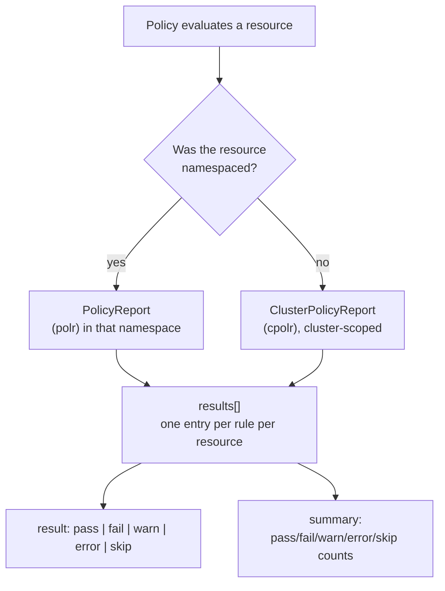

# Reading PolicyReports

A policy in `Audit` mode blocks nothing. A policy with `background: true` never touches the resources it disagrees with. Both of them are still telling you something — they are writing it into a `PolicyReport`, and if you cannot read one, the entire audit half of Kyverno is invisible to you.

This module is about that read path. You will learn which two objects Kyverno writes findings into, how those objects are named and scoped, what each of the five possible result values actually means, and how to pull a specific answer out of a report instead of scrolling through YAML.

## How this module is organised

1. **[Part 1 — PolicyReport and ClusterPolicyReport](./course-01-policyreport-and-clusterpolicyreport.md)** — the two CRDs, who owns them, how they are named and scoped, and what is inside one.
2. **[Part 2 — Reading Results: the Five Result Types](./course-02-reading-results-and-result-types.md)** — what `pass`, `fail`, `warn`, `error`, and `skip` each mean, and how to query for exactly the one you care about.

## Learning objectives

After this module you can:

- Name the two report CRDs, their API group, and their short names, and say which one holds findings for a namespaced resource versus a cluster-scoped one.
- Explain why a modern Kyverno report is named after a UUID rather than after the policy, and find the resource a given report describes.
- Read the `scope`, `results[]`, and `summary` fields of a report and describe what each contributes.
- Distinguish `pass`, `fail`, `warn`, `error`, and `skip`, and name the specific condition that produces each.
- Explain what the `policies.kyverno.io/scored: "false"` annotation changes about a report.
- Pull just the failing results out of a report with `kubectl` and `jsonpath`, without reading the whole object.

## Before you start

You should already be comfortable applying a `ClusterPolicy` and know what `validationFailureAction: Audit` versus `Enforce` does at admission time. The linked lab gives you a kind cluster with Kyverno v1.13.2 pre-installed and a namespace that already contains both a compliant and a non-compliant workload, so there is something real for the reports to describe.
