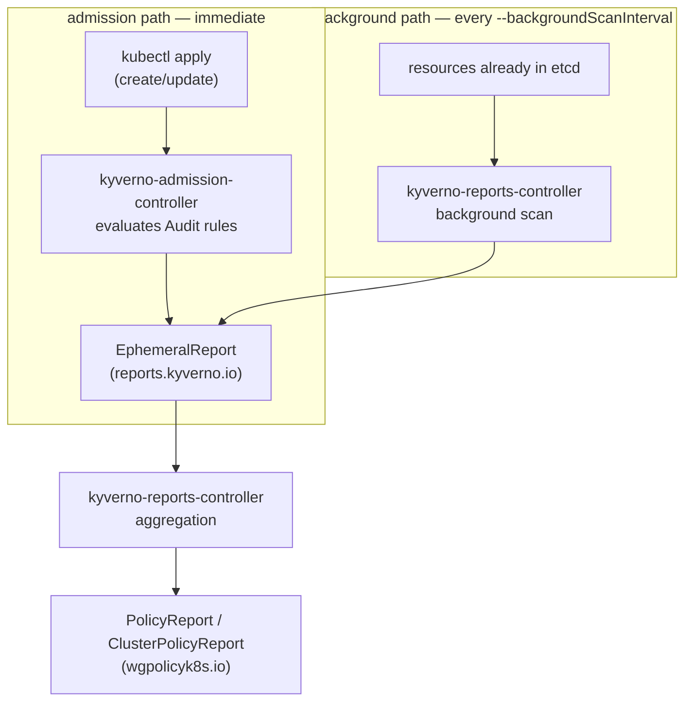

# The Reports Pipeline & Its Tuning

Module 1 treated reports as things that exist. This module is about where they come from, why one can be a minute old and another an hour old, and which knob you turn when a report is missing, stale, or drowning your API server in objects.

There are two completely separate paths into a `PolicyReport`, run by two different controllers on two different schedules, and almost every "why is my report wrong?" question resolves into "you were looking at the wrong path".

## How this module is organised

1. **[Part 1 — The Reports Pipeline](./course-01-the-reports-pipeline.md)** — the admission path, the background path, the intermediate `EphemeralReport` objects, and which controller owns each step.
2. **[Part 2 — Tuning and Troubleshooting Reports](./course-02-tuning-and-troubleshooting-reports.md)** — `--backgroundScanInterval`, `--backgroundScanWorkers`, `--enableReporting`, `resourceFilters`, and the diagnostic order for a report that is not there.

## Learning objectives

After this module you can:

- Name the controller that produces admission-time report data and the controller that produces background-scan report data, and explain why they are separate.
- Explain what an `EphemeralReport` is, why it exists, and why you should never build tooling against one.
- Predict how long a newly-created violation takes to appear in a report, for both the admission path and the background path.
- Change `--backgroundScanInterval` on the reports controller and explain the cost of lowering it.
- Explain what `--enableReporting` controls and what happens when you remove a rule type from it.
- Explain why adding a namespace to `resourceFilters` does **not**, by default, stop background-scan reports for that namespace, and name the flag that changes this.
- Work through a missing-report diagnosis in a defensible order instead of guessing.

## Before you start

You should have completed Module 1 and be comfortable reading a `PolicyReport` with `kubectl`. The linked lab gives you a kind cluster with Kyverno v1.13.2 and a pre-existing non-compliant Deployment, and asks you to make a background scan happen on your schedule rather than Kyverno's default hourly one.
