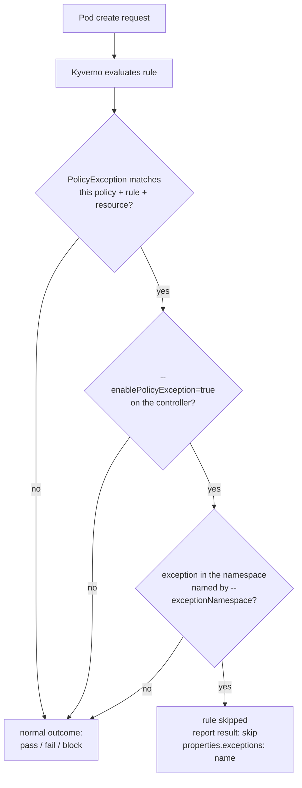

# Enabling & Writing a PolicyException

Sooner or later a policy that is right for the cluster is wrong for one workload. The migration Job that genuinely cannot set memory limits. The vendor image that insists on a host path. The legacy Deployment that will be rewritten next quarter, but not this week.

You have three ways to handle that, and only one of them is good. You can weaken the policy for everybody. You can bolt an `exclude` block onto the policy naming that one workload, burying an exemption inside the document that is supposed to be your enforcement source of truth. Or you can write a `PolicyException`: a separate, named, reviewable object that says exactly which rule is waived for exactly which resources, and shows up in your reports as a `skip` you can point at during an audit.

This module covers turning the feature on — it is off by default, for good reasons — and writing an exception that does what you meant.

## How this module is organised

1. **[Part 1 — Enabling PolicyExceptions](./course-01-enabling-policyexceptions.md)** — why the feature ships disabled, the two flags, which controllers need them, and what happens when you get it half-right.
2. **[Part 2 — The Anatomy of a PolicyException](./course-02-anatomy-of-a-policyexception.md)** — every field in the object, the autogen rule-name trap, and how an exception shows up in a report.

## Learning objectives

After this module you can:

- State the `apiVersion` and `kind` of a PolicyException on Kyverno v1.13 and explain that it is a namespaced object.
- Enable PolicyExceptions with `--enablePolicyException=true` and scope them with `--exceptionNamespace`, and explain why the second flag exists.
- Explain the failure mode of enabling exceptions on the admission controller but not the reports controller.
- Write a `PolicyException` that names a policy, the specific rules within it, and the resources to exempt.
- Explain why exempting a Deployment usually requires naming both a rule and its `autogen-` counterpart.
- Find the exemption in a `PolicyReport` and name the field that records which exception applied.

## Before you start

You should be comfortable applying a `ClusterPolicy` in `Enforce` mode and reading a `PolicyReport` (Section 010). The linked lab gives you a kind cluster with Kyverno v1.13.2, an `Enforce` policy already in place, and a legacy workload that the policy blocks — your job is to let exactly that workload through, and nothing else.
