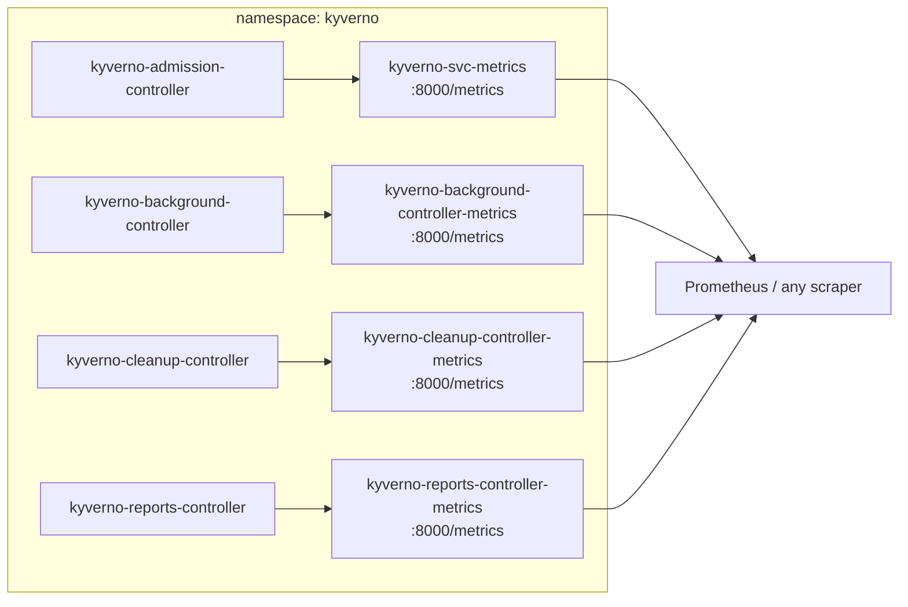

# The Metrics Endpoint & Core Metric Families

Reports tell you about your *workloads*. Metrics tell you about *Kyverno*. They answer a different class of question entirely: is the admission webhook adding latency to every write in the cluster? Which policy is evaluated most often? Did somebody change a policy at 03:00 last night? Is one rule failing thousands of times an hour, or was it a single bad deploy?

None of that is in a `PolicyReport`, and all of it is one Prometheus scrape away.

## How this module is organised

1. **[Part 1 — The Metrics Endpoint and Its Services](./course-01-metrics-endpoint-and-services.md)** — where metrics come from, the four Services, the flags that control exposure, and three ways to read the endpoint by hand.
2. **[Part 2 — The Core Metric Families](./course-02-core-metric-families.md)** — the metrics worth knowing by name, their labels, the `_total` suffix surprise, and the PromQL that turns them into answers.

## Learning objectives

After this module you can:

- Name the port and path Kyverno exposes metrics on, and the four Services that front them.
- Explain why each controller has its own metrics endpoint and which one to scrape for a given question.
- Read the `--disableMetrics`, `--metricsPort` and `--otelConfig` flags and say what each controls.
- Fetch the raw metrics endpoint from inside the cluster and from your own machine.
- Identify `kyverno_policy_results_total`, `kyverno_policy_rule_info_total`, `kyverno_admission_requests_total`, `kyverno_admission_review_duration_seconds`, `kyverno_policy_execution_duration_seconds` and `kyverno_policy_changes_total`, and say what question each answers.
- Explain why the docs say `kyverno_policy_results` while the endpoint says `kyverno_policy_results_total`.
- Write PromQL that answers "which rules are failing most" and "how much latency is Kyverno adding".

## Before you start

You need no Prometheus installation for this module — everything is done against the raw `/metrics` text endpoint with `curl`. The linked lab gives you a kind cluster with Kyverno v1.13.2 and a pre-created probe Pod you can `kubectl exec` into to scrape from inside the cluster.
